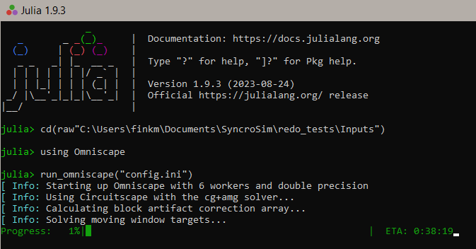

Omniscape Notes
================

## Preparation

#### Multithreading

*Before* starting Julia console and running Omniscape, create a new
Windows Environment Variable:

`JULIA_NUM_THREADS` and make the value the number of processors you want
to use (MMF uses **6**).

#### Resistance Layer

*Cannot contain zeroes!* Also, see **Data Limitations** below.

#### Running Omniscape

## Example config.ini

    [Required] 
    resistance_file = PATH\TO\Inputs\LDI_rescaledlinear.tif 
    radius = 268 
    project_name = PATH\TO\Results\Results10mi 
    source_file = None

    [General Options] 
    block_size = 95 
    source_from_resistance = true 
    resistance_is_conductance = false 
    r_cutoff = 10.0 
    buffer = 0 
    source_threshold = 0.0 
    calc_normalized_current = true 
    calc_flow_potential = false 
    allow_different_projections = false 
    connect_four_neighbors_only = false 
    solver = cg+amg

    [Resistance Reclassification] 
    reclassify_resistance = false 
    reclass_table = None 
    write_reclassified_resistance = true

    [Conditional Connectivity] 
    conditional = false 
    n_conditions = 1 
    condition1_file = None 
    comparison1 = within 
    condition1_lower = NaN 
    condition1_upper = NaN 
    condition2_file = None 
    comparison2 = within 
    condition2_lower = NaN 
    condition2_upper = NaN 
    compare_to_future = none 
    condition1_future_file = None 
    condition2_future_file = None

    [Output Options] 
    write_raw_currmap = true 
    mask_nodata = true 
    write_as_tif = true

    [Multiprocessing] 
    parallelize = true 
    parallel_batch_size = 10 

## Data Limitations

Omniscape is prone to fatal errors, particularly *riiiight* before an
hours-long analysis finishes. The following seems to help:

- Resistance layer **value range** seems to be a big factor. When using
  the LDI (range 0-2150) as resistance, *rescale* the value range to
  1-100.
- Resistance layer **NoData value**. For floating-point rasters, ESRI’s
  default NoData value is -3.4E+38. If experiencing errors, try changing
  it to something like 999 when rescaling the range.
- Try a **smaller window** size if necessary. Smaller windows take
  longer, but you can compensate somewhat by using a proportionally
  higher blocksize. Blocksize should be no more than 10% of the window
  size (in area as counts of cells).
